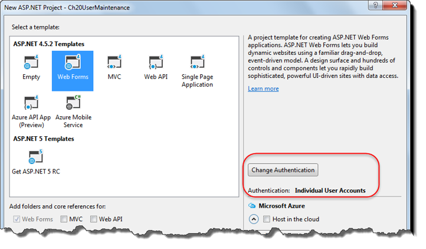
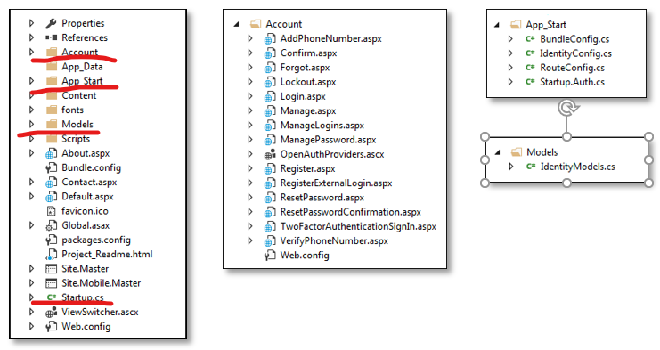
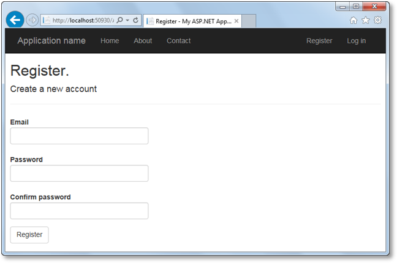
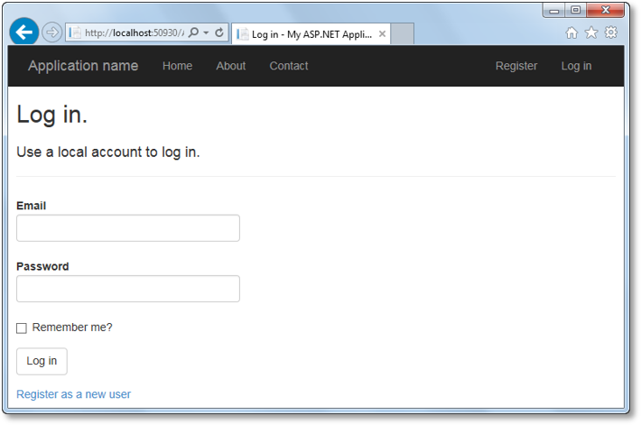
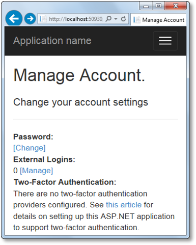
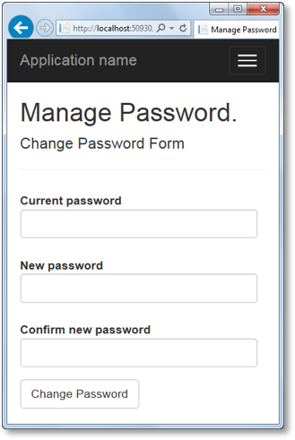

# ASP.NET - Tutorials


## Authenticate and Authorize Users
- restirct access to some of the pages of an application
- use of the ASP.NET Identity system.
- Authentication refers to the process of validating the identity of a user so the user  can be granted access to an application. 
- After a user is authenticated, the user must still be authorized to use the requested application. The process of granting user access to an application is called authrization.

### Types of authentications
***Windows-based authentication***  
- Causes the browser to display a login dialog box when the user attempts to access a restricted page.
- Is supported by most browsers.
- Is configured through the IIS management console.
- Uses Windows user accounts and directory rights to grant access to restricted pages.
- Is most appropriate for an intranet application.
***Individual user account authentication***  
- Allows developers to code a login form that gets the user name and password.
- The user name and password entered by the user are encrypted if the login page uses a secure connection.
- Doesn’t rely on Windows user accounts. Instead, the application determines how to authenticate users.
***Third-party authentication services***
- Provided by third parties using technologies like OpenID and OAuth. The Facebook, Google, and Twitter services are the most popular, but Microsoft also offers this kind of service.
- Allows users to use their existing logins, and frees developers from having to worry about the secure storage of user credentials.
- You can configure your ASP.NET applications to issue identities or accept identities from other web applications, and even access user data on other services.
### How individual user account authentication works
- When ASP.NET receives a request for a protected page from a suer who has not been authenticated, the server redirects the user to the login page.
- To be authenticated the user's computer must contain an authentication cookie. By default, this cookie is stored as a session cookie.
- ASP.NET automatically creates an authentication cookie when the application indicates that the user should be authenticated.  
### An intro to ASP.NET Identity
- It can be used with all ASP.NET frameworks, including Web Forms, MVC, and Web API.
- You have more control over the schema of the data store that holds user information, and it’s easier to change the storage system from the default of SQL Server.
- It’s modular, so it’s easier to unit test.
- It supports claims-based authentication, which can be more flexible than using simple roles.
- It supports third party login providers like Microsoft, Google, Facebook, and Twitter.
- It’s based on OWIN (Open Web Interface for .NET) middleware, which is an open source project that defines a standard interface between .NET web servers and web applications. 
- It’s distributed as a NuGet package, so Microsoft can deliver new features and bug fixes faster than before.
### The main objects used by ASP.NET Identity

| Object |  Description
| -------| ----------
| OwinContext  | The OWIN context for the current request
| IdentityDbContext | An EF DbContex  object for working with the Users, Roles, Claims, and Logins of the ASP.NET Identity system.
| IdentityUser | Represents ans authenticated user
| UserStore | Works with users at the database level
| UserManager | Accepts a UserStore and works with users at the application level.
| IdentityRole | Represents a role
| RoleStore | Works with roles at the database level
| RoleManager | Accepts a RoleStore and works with roles at the application level.
| IdentityUserRole | Represents a user that belongs to a role
| SignInManager | Manages sign in operations for users.
| SignInStatus | An enumeration whose values represent the result of a sign in attempt.
| IdentityResult | Represents the result of an identity operation
| ClaimsIdentity | Represents a claims-based identity  
<br/>

### How to get the OwinContext object for the current request
```C#
// In a Code-behind file:
	var ctx = Context.GetOwinContext();

// In a non-page file
	var ctx = HttpContext.CurrentGetOwinContext();
```
<br/>

## How to Create a Web Application that Authenticates Users
-  The Web Forms template uses Individual User Accounts authentication by default.
- The file in the Account, App_Start, and Models directories, along with the StartUp.cs file in the root directory, contain the code for a functioning authentications system. 



### How to work with the LoginView and Login Status control
- The master page includes a Bootstrap navbar that contains a LoginView control. This control displays links that let anonymous users register or log in. If a user is already authenticated, this control displays a link with the user's name and log off link. The log off link uses the LoginStatus control.  

**aspx code for the navbar in the master page:**   
```C#
<div class="navbar-collapse collapse">
    <ul class="nav navbar-nav">
        <li><a runat="server" href="~/">Home</a></li>
        <li><a runat="server" href="~/About">About</a></li>
        <li><a runat="server" href="~/Contact">Contact</a></li>
    </ul>
    <asp:LoginView runat="server" ViewStateMode="Disabled">
        <AnonymousTemplate>
            <ul class="nav navbar-nav navbar-right">
                <li><a runat="server" href="~/Account/Register">
                       Register</a>
                </li>
                <li><a runat="server" href="~/Account/Login">
                       Log in</a>
                </li>
            </ul>
        </AnonymousTemplate>
        <LoggedInTemplate>
            <ul class="nav navbar-nav navbar-right">
                <li><a runat="server" href="~/Account/Manage" 
                       title="Manage your account">Hello, 
                       <%: Context.User.Identity.GetUserName()  %>
                       !</a>
                </li>
                <li>
                    <asp:LoginStatus runat="server"
                        LogoutAction="Redirect" 
                        LogoutText="Log off" LogoutPageUrl="~/" 
                        OnLoggingOut="Unnamed_LoggingOut" />
                </li>
            </ul>
        </LoggedInTemplate>
    </asp:LoginView>
</div>
```  
**LogginOut event of the LoginStatus control:**  
```C#
protected void Unnamed_LoggingOut(object sender,
    LoginCancelEventArgs e)
{
    Context.GetOwinContext().Authentication.SignOut(
        DefaultAuthenticationTypes.ApplicationCookie);
}

```  
### How to Register a User  
- The register page creates a new user and signs them in to the application. It also includes commented out sample code with a link to more information. 
- By default, the user is redirected to the home page when registration succeeds.
  
**Code for the Click event of the Register button**  
```C#
protected void CreateUser_Click(object sender, EventArgs e)
{
    var manager =
        Context.GetOwinContext()
            .GetUserManager<ApplicationUserManager>();
    var signInManager = 
        Context.GetOwinContext().Get<ApplicationSignInManager>();
    var user = new ApplicationUser() {
         UserName = Email.Text, Email = Email.Text };
    IdentityResult result = manager.Create(user, Password.Text);
    if (result.Succeeded) {
        // For more information on how to enable account
        // confirmation and password reset please visit 
        // http://go.microsoft.com/fwlink/?LinkID=320771
        // commented out sample code for how to handle an email
        // confirmation 

        signInManager.SignIn( 
            user, isPersistent: false, rememberBrowser: false);
        IdentityHelper.RedirectToReturnUrl(
            Request.QueryString["ReturnUrl"], Response);
    }
    else {
        ErrorMessage.Text = result.Errors.FirstOrDefault();
    }
}
```  
### How to Log In a User  
  
**Code for the Click event of the Log In button**  

```C#
protected void LogIn(object sender, EventArgs e)
{
  if (IsValid) {
      var manager = Context.GetOwinContext()
          .GetUserManager<ApplicationUserManager>();
      var signinManager = Context.GetOwinContext()
          .GetUserManager<ApplicationSignInManager>();
      // This doesn't count login failures towards account
      // lockout. To enable password failures to trigger lockout,
      // change to shouldLockout: true
      var result = signinManager.PasswordSignIn(
          Email.Text, Password.Text, RememberMe.Checked,
          shouldLockout: false);

      switch (result) {
          case SignInStatus.Success:
            IdentityHelper.RedirectToReturnUrl(
                Request.QueryString["ReturnUrl"], Response);
            break;
          case SignInStatus.LockedOut:
            Response.Redirect("/Account/Lockout");
            break;
          case SignInStatus.RequiresVerification:
            Response.Redirect(String.Format(
              "/Account/TwoFactorAuthenticationSignIn" +
              "?ReturnUrl={0}&RememberMe={1}",
              Request.QueryString["ReturnUrl"],
              RememberMe.Checked), true);
            break;
          case SignInStatus.Failure:
          default:
            FailureText.Text = "Invalid login attempt";
            ErrorMessage.Visible = true;
            break;
    }
  }
}
```  

### How to change a User's Password  
- The ManagePassword.aspx page of the Web Forms template
    
**Code for the Click event of the Change Password button**  
```C#
protected void ChangePassword_Click(object sender, EventArgs e)
{
    if (IsValid)
    {
        var manager = Context.GetOwinContext()
            .GetUserManager<ApplicationUserManager>();
        var signInManager = Context.GetOwinContext()
            .Get<ApplicationSignInManager>();

        IdentityResult result = manager.ChangePassword(
            User.Identity.GetUserId(), CurrentPassword.Text, NewPassword.Text);

        if (result.Succeeded) {
            var user = manager.FindById(User.Identity.GetUserId());
            signInManager.SignIn( user, isPersistent: false,
                rememberBrowser: false);
            Response.Redirect("~/Account/Manage?m=ChangePwdSuccess");
        }
        else 
            AddErrors(result);
        }
    }
}
```  

### How to change basic Configuration Options
- To adjust things like the password length and the number of login failures that are allowed, you can modify the code in the ***IdentityConfig.cs***file.
**The static Create method in the IdentityConfig.cs file**  

```C#
public static ApplicationUserManager Create(
    IdentityFactoryOptions<ApplicationUserManager> options, 
    IOwinContext context)
{
    var manager = new ApplicationUserManager(
        new UserStore<ApplicationUser>(
            context.Get<ApplicationDbContext>()));
    // Configure validation logic for usernames
    manager.UserValidator =
        new UserValidator<ApplicationUser>(manager) {
            AllowOnlyAlphanumericUserNames = false,
            RequireUniqueEmail = true
    };

    // Configure validation logic for passwords
	
    . . .
	
    return manager;
}
```  

