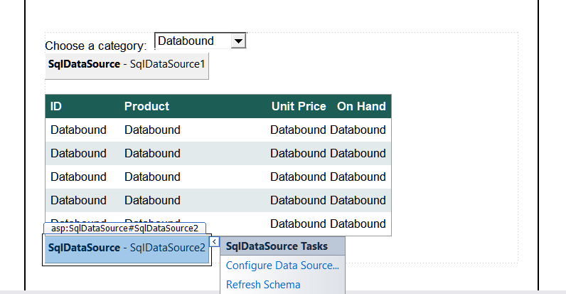
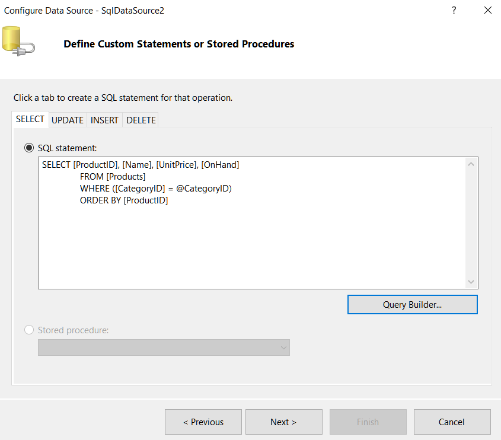
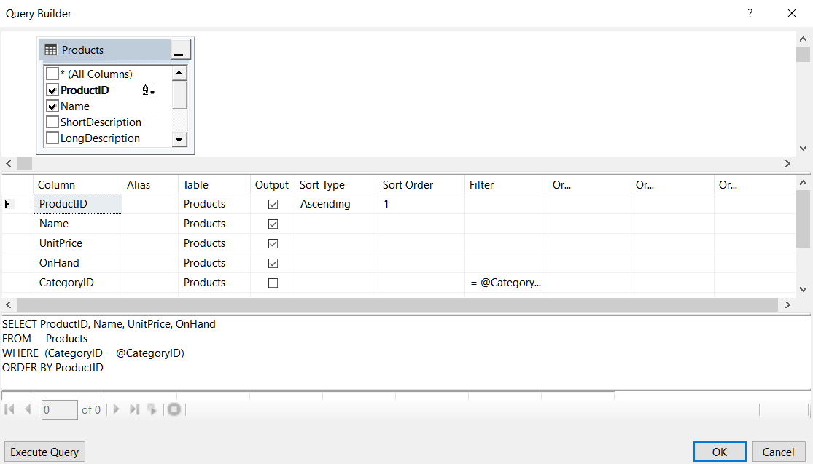
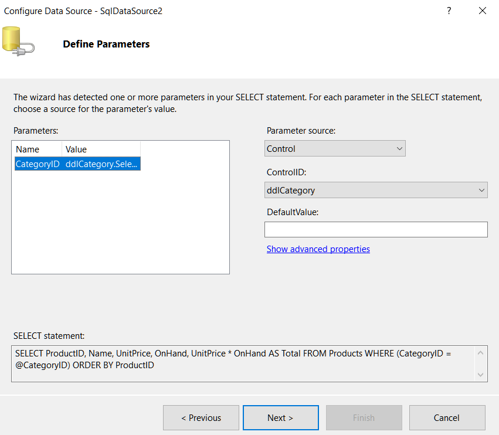
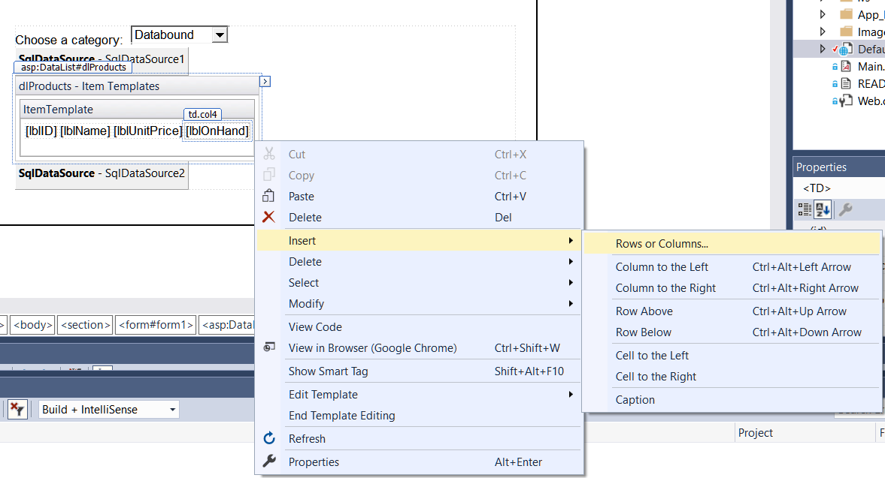
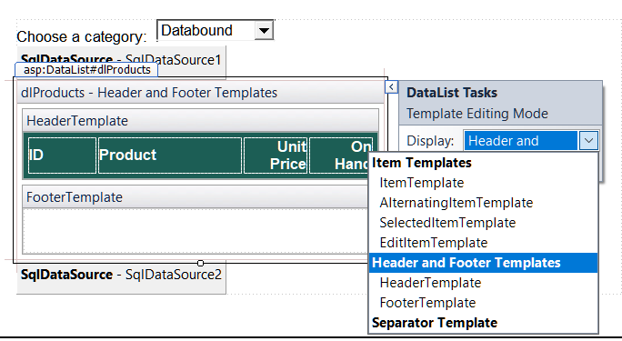

# ASP.NET - Tutorials

### SQL Data Source Control

- A **SqlDataSource** control provides the information an application needs to connect to a database and retrieve the data needed by the application. It can also be used to insert, update, and delete data.
- A SQL data source can be bound to another control, such as a drop down list or a DataList control. Then, the data that's retrieved by the data source is displayed in that control.  
- The data source type is Database by default; you can change it to Entity, LINQ, Object, Site Map, and XML File
- You can choose from a previously created connection for a database; or create a new connection.
- ASP.NET applications can store connection strings in the Web.config file. If you save the connection string in the Web.config file, the ConnectionString property of the data source control will include a special code that retrieves the connection string from the Web.config file.
```ASP
  <connectionStrings>
    <add name="HalloweenConnection" connectionString="Data Source=(LocalDB)\MSSQLLocalDB;AttachDbFilename=|DataDirectory|\Halloween.mdf;Integrated Security=True"
      providerName="System.Data.SqlClient" />
  </connectionStrings>
```
- ADO.NET provides two basic ways to retrieve data from a database. You can either retrieve the data into a **dataset**, which retrains a copy of the data in memory so it can be accessed multiple times,and updated if necessary. Or, you can retreive the data using a **data reader**, which lets you retreive the data in forward-only, read-only fashion.
- The **DataSourceMode** property lets you specify that data should be retreived using a data reader rather than being stored in a dataset.  
```ADO
   <asp:SqlDataSource ID="SqlDataSource2" runat="server" 
		ConnectionString="<%$ ConnectionStrings:HalloweenConnection %>" 
		DataSourceMode="DataReader"
		SelectCommand="SELECT [ProductID], [UnitPrice] FROM [Categories]">
	</asp:SqlDataSource>
```
- The data source **EnableCaching** property lets you specify that data should be stored in cache storage for a specific period of time.  
```ADO
   <asp:SqlDataSource ID="SqlDataSource2" runat="server" 
		ConnectionString="<%$ ConnectionStrings:HalloweenConnection %>" 
		EnableCaching="True" CacheDuration="60"
		SelectCommand="SELECT [ProductID], [UnitPrice] FROM [Categories]">
	</asp:SqlDataSource>
```
- Define a Select statement in the dialog box.
- When you create a WHERE clause, the wizard creates one or more select parameters that provide the values used by the WHERE clause. Each SqlDataSource control that includes select parameters is defined by a SqlDataSource element that includes a child element named SelectParameters. 
```ASP
	<asp:SqlDataSource ID="SqlDataSource2" runat="server" 
		ConnectionString="<%$ ConnectionStrings:HalloweenConnection %>" 
		SelectCommand="SELECT [ProductID], [UnitPrice], [Quantity], [Extension] 
		FROM [LineItems] WHERE ([InvoiceNumber] = @InvoiceNumber)">
		<SelectParameters>
			<asp:ControlParameter ControlID="ddlInvoice" Name="InvoiceNumber" 
				PropertyName="SelectedValue" Type="Int32" />
		</SelectParameters>
	</asp:SqlDataSource>
```

### DataList Control
- A **data list** displays a list of items from the data source that it's bound to. To bind a data list to a data source, use the Choose Data Source command in the control's smart tag menu.
- To define the infromation to be displayed in a data list, you create one or more templates. VS provides a designer interface.
- To display the data from a column in the data source in a data list, you add a control to a template and then bind that control.
- You can use a DataList control for edit operations as well as diplay operations. However, you're more likely to use the GridView, DetailsView, FormView, and ListView control for edit operations.
```ASP
	<asp:DataList ID="dlLineItems" runat="server" DataSourceID="SqlDataSource2"
		CssClass="table table-bordered table-striped table-condensed">
		<HeaderTemplate>
			<span class="col-xs-3">Product</span>
			<span class="col-xs-3 text-right">Unit Price</span>
			<span class="col-xs-3 text-right">Quantity</span>
			<span class="col-xs-3 text-right">Extension</span>
		</HeaderTemplate>
		<ItemTemplate>
			<asp:Label ID="ProductIDLabel" runat="server" 
				Text='<%# Eval("ProductID") %>' CssClass="col-xs-3" />
			<asp:Label ID="UnitPriceLabel" runat="server" 
				Text='<%# Eval("UnitPrice", "{0:C}") %>' CssClass="col-xs-3 text-right" />
			<asp:Label ID="QuantityLabel" runat="server" 
				Text='<%# Eval("Quantity") %>' CssClass="col-xs-3 text-right" />
			<asp:Label ID="ExtensionLabel" runat="server" 
				Text='<%# Eval("Extension", "{0:C}") %>' CssClass="col-xs-3 text-right" />
		</ItemTemplate>
		<HeaderStyle CssClass="bg-halloween" />
	</asp:DataList>
```

### Data Binding
- You can bind any of the controls that inherit the ListControl class to a data source; List box control, drop-down list control, check box list control, radio button list control.
- You can use the Data Source Configuration Wizard to select the data source for a list control. 
- You can also use the DataTextFormatString property of a list control to specify a format string. 
- To bind a control in a template, select the Edit DataBindings command from the smart tag menu for the control to display the DataBindings dialog box. Then, select the property you want to bind to (usually Text).
- The Eval method provides only for displaying data from a data source in a control. In contrast, the Bind method provides for two-way binding, which means that it can be used to display as well as update data from a data source.  
```ASP
<%# Eval("Name") %>
<%# Bind("UnitPrice", "{0:C}") %>
```  
**Exercise - Project**  
#### Update the data source**  
1. Open the XEx13ProductList application in your exercises_extra directory. This is the Product List application that was present in chapter 13 of the book.
2. Select the Configure Data Source command from the smart tag menu of the SQL data source for the data list control to start the Configure Data Source wizard.  
  
3. Click the Next button when the first dialog box is displayed to use the current connection, and click the Next button again in the second dialog box to enter a custom SQL statement.  
 
4. The Select tab in the next dialog box will contain the current Select statement. Now, click the Query Builder button to display the Query Builder.  
   
5. Use the grid pane to add a calculated column that multiplies the UnitPrice column by the OnHand column, and assign an alias of Total to this column. Then, accept this change to return to the Configure Data Source dialog box.
6. Click the Next button, and then click the Next button again in the dialog box that lets you define parameters.  
  
7. Test the query in the last Configure Data Source dialog box, and then click the Finish button.
8. When you’re asked if you want to regenerate the DataList ItemTemplate and DataKeyField, click No. Notice that the data list hasn’t changed, but the data source has.  
#### Update the data list
9. Display the data list in template-editing mode, and add a column to the Item template. To do that, position the mouse pointer above the last column so a down-arrow is displayed and click to select that column. Then, right-click the tab that identifies the column, and select InsertColumn to the Right from the shortcut menu that’s displayed.  
  
10.	Add a label to the new column, and assign the ID lblTotal to it. Then, bind it to the Total field of the data source and apply the currency format.  
  
11.	Display the Header template, add another column, and enter the text “Total” in the column.  
  
12.	End template-editing mode, and review the aspx code for the two new columns. Then, run the application to be sure it looks as shown above.  
```ASP.NET
        <asp:DataList ID="dlProducts" runat="server" DataKeyField="ProductID" 
            DataSourceID="SqlDataSource2" CellPadding="4">
            <HeaderTemplate>
                <table>
                    <tr>
                        <td class="col1">ID</td>
                        <td class="col2">Product</td>
                        <td class="col3">Unit Price</td>
                        <td class="col4">On Hand</td>
                        <td class="col4">Total</td>
                    </tr>
                </table>
            </HeaderTemplate>
            <ItemTemplate>
                <table>
                    <tr>
                        <td class="col1">
                            <asp:Label ID="lblID" runat="server" 
                                Text='<%# Eval("ProductID") %>' />
                        </td>
                        <td class="col2">
                            <asp:Label ID="lblName" runat="server" 
                                Text='<%# Eval("Name") %>' />
                        </td>
                        <td class="col3">
                            <asp:Label ID="lblUnitPrice" runat="server" 
                                Text='<%# Eval("UnitPrice", "{0:C}") %>' />
                        </td>
                        <td class="col4">
                            <asp:Label ID="lblOnHand" runat="server" 
                                Text='<%# Eval("OnHand") %>' />
                        </td>
                        <td class="col4">
                            <asp:Label ID="lblTotal" runat="server" Text='<%# Eval("Total", "{0:C}") %>'></asp:Label>
                        </td>
                    </tr>
                </table>
            </ItemTemplate>
            <AlternatingItemStyle BackColor="#E3EAEB" />
            <HeaderStyle BackColor="#1C5E55" Font-Bold="True" ForeColor="White" />
        </asp:DataList>
```


---